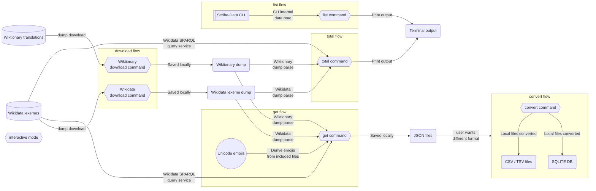

# [Architecture](https://github.com/scribe-org/Scribe-Data/blob/main/ARCHITECTURE.md)

This markdown file documents the architecture for the Scribe-Data CLI - including all processes and the external systems and sources with which it interacts. The diagram details the CLI [convert](./src/scribe_data/cli/convert/), [download](./src/scribe_data/cli/download/), [get](./src/scribe_data/cli/get.py), [list](./src/scribe_data/cli/list/) and [total](./src/scribe_data/cli/total/) commands, with [interactive](./src/scribe_data/cli/interactive/) being a command itself and also an option within other commands via the `--interactive` (`-i`) option.

CLI outputs that are used in multiple flows appear as nodes outside of any nodes for clarity. As the file is meant to be a living document, edits are welcome to expand and update it!

> [!NOTE]
> You can see the architecture diagram for all of [Scribe](https://github.com/scribe-org) [here](https://github.com/scribe-org/Organization/blob/main/ARCHITECTURE.md).

## Architecture Diagram

> [!NOTE]
> The architecture diagram above was created using the diagramming tool [Mermaid](https://github.com/mermaid-js/mermaid), with rendering supported in GitHub markdown.
